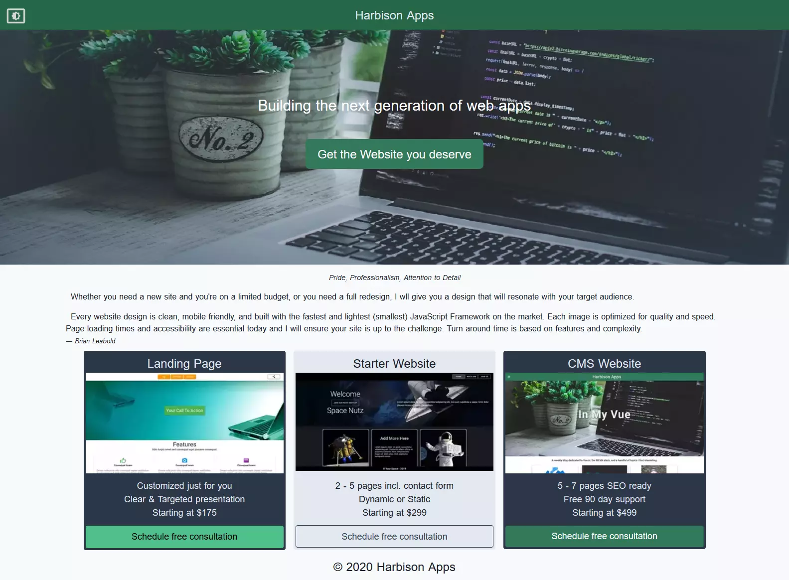

# harbisonapps-tailwind

> Harbison Apps - Nuxt web app styled with Tailwind



>This version of Harbison Apps website is built on Nuxt with PWA support. The blog is backed by Storyblok.
And and 99% of the CSS is courtesy of Tailwind.


## Setup

``` bash
# install dependencies
$ npm run install
```
## Dev Build

```bash
# serve with hot reload at localhost:3000
$ npm run dev
```

# build for production and launch local server
```bash
$ npm run build
$ npm run start
```
# generate static project
```bash
# generate all static assets
$ npm run generate
```

Live version COMING SOON

For a detailed explanation of how Nuxt works, check out [Nuxt.js docs](https://nuxtjs.org).
